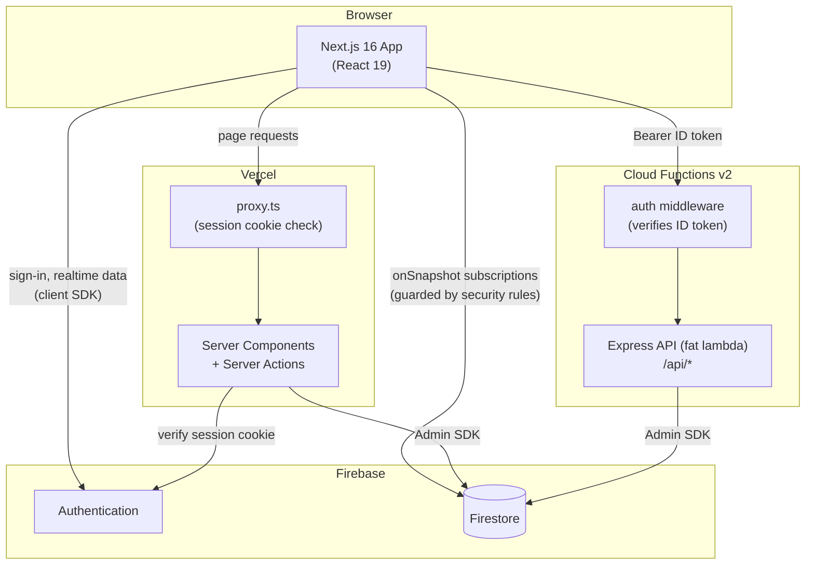
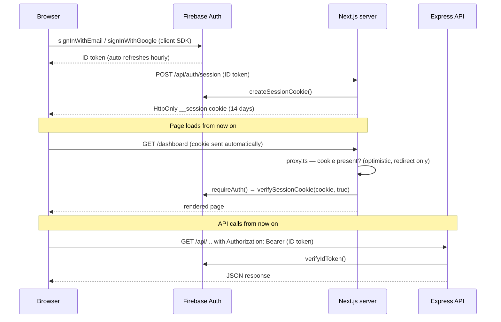

# Architecture

## System Overview

The system has three parts: a **Next.js frontend** (deployed to Vercel), an **Express API** running as a single Cloud Function (optional — deployed to Firebase, requires the Blaze plan), and **Firebase services** (Auth, Firestore) used by both. There's no local emulator — the app always talks to a real Firebase project (use a free project for local dev).

The frontend is server-rendered (Server Actions, `proxy.ts`, `/api/auth/session`), so it needs a server host. It deploys to Vercel's free Hobby tier rather than Firebase Hosting, since Firebase Hosting's SSR integration runs on Cloud Functions/Cloud Run and requires Blaze even at zero traffic — Vercel doesn't.



Three paths to the data, each with its own guard:

| Path | Used for | Guarded by |
|------|----------|-----------|
| Browser → Firestore (client SDK) | Real-time subscriptions in Client Components | **Firestore security rules** |
| Browser → Server Component / Server Action | SSR pages, mutations | **`requireAuth()`** (verifies session cookie) |
| Browser → Express API | Business logic endpoints, heavy operations | **auth middleware** (verifies ID token) |

## Authentication Flow



**Critical:** the cookie check in `proxy.ts` is optimistic (presence only) — it exists to redirect signed-out users, not to enforce security. Cryptographic verification always happens server-side near the data: `requireAuth()` in Server Actions/Components, the auth middleware in the API.

## Request Patterns

### Server-rendered page (Server Component)
1. Browser requests `/dashboard`
2. `proxy.ts` checks the `__session` cookie → redirects to `/auth/signin` if absent
3. Server Component calls `requireAuth()`, then fetches Firestore data via the Admin SDK
4. HTML is streamed to the browser

### Client-side real-time data
1. Client Component mounts
2. `useCollection()` hook subscribes to Firestore via `onSnapshot`
3. UI updates live as data changes — Firestore security rules enforce access

### Mutation (Server Action)
1. Client Component calls a Server Action
2. Action calls `requireAuth()`, validates input with Zod, writes via the Admin SDK
3. Returns `ActionResult<T>` — `{ success, error?, data? }`

### API call (Cloud Functions)
1. Client obtains a Firebase ID token: `user.getIdToken()`
2. Client sends `Authorization: Bearer {token}` to `/api/...`
3. Auth middleware verifies the token and attaches `req.user`
4. Route handler validates input with Zod, queries Firestore, responds

## Backend Structure

The backend is deliberately flat — a single Express app in one Cloud Function:

```
backend/src/
├── index.ts        Cloud Function entry (exports `api`)
├── app.ts          Express app factory
├── routes/         One file per resource
├── middleware/     auth (ID token → req.user), errorHandler (RFC 9457)
└── lib/            firebase (Admin singleton), errors (HttpError), zodConverter
```

Two conventions are enforced by a CI test (`backend/tests/unit/conventions.test.ts`): Firebase Admin is imported only via `lib/firebase.ts`, and no `console.log` in `src/`. See `docs/BACKEND.md` for the route handler pattern.

## Security Model

- **Firestore rules** — last line of defence; always assume clients are untrusted
- **Cloud Functions** — verify ID tokens in the auth middleware for every protected route
- **Next.js Server Actions** — call `requireAuth()` (verifies session cookie via Admin SDK) before any data operation
- **proxy.ts** — optimistic cookie check only; used for redirects, never for security

See `docs/SECURITY.md` for the full layered security reference.

## Key Design Decisions

**Why session cookies instead of just Firebase client auth?**
Next.js route interception (`proxy.ts`) runs on a lightweight runtime and cannot use the Firebase Admin SDK. The session cookie gives it a cheap signal for redirects. Cryptographic trust is established server-side near the data.

**Why feature-based folder structure?**
Features in `frontend/src/features/{feature}/` are self-contained — types, hooks, actions, and components together. Deleting a feature means deleting one folder. Cross-feature imports are explicit violations of the intended boundary.

**Why Express on Cloud Functions instead of individual functions?**
The "fat-lambda" pattern keeps local development identical to production (just run Express locally), simplifies testing with supertest, and avoids cold starts multiplied across many functions.

**Why a flat backend instead of layered "clean architecture"?**
At this size, layers add indirection without payoff. The two properties that matter — swappable auth for tests and a single Firebase entry point — are kept via one injected function (`verifyToken`) and one module (`lib/firebase.ts`), both enforced by tests rather than folder structure.
